# Python fundamentals

## 1. SYNTAX

# Komentare

- ak iba jeden riadok => #
- na viac riadkov => """..."""

```py
napatie = 5  # V s t u p n e n a p a t i e [ V ]
def pocitaj_odpor(napatie, prud):
"""
vypocet podla Ohmovho zakona [ V ]
"""
odpor = napatie / prud
return odpor
```

# Premenne

- nesmie zacinat cislom a nesmie byt zhodna s klucovym slovom

```python
roky, polomer_kruhu, x1, x2, y...
```

- hodnotu priratam pomocou `=`

```python
a = 22
b = 10
```

# Dynamicke typovanie

- Python typuje hodnoty a premenne nemaju typ:
  Zakladne typy:
  - noneType - `None`
  - boolean - `True/False`
  - cele cisla - `integer (i)`
  - desatine/realne cisla - `float (f)`
  - komplexne cisla/komplexna zlozka j - `complex, 1+2j`
  - retazce - `str`
  - kolekcie - `list`, `dict`, `set`

```python
x = 22
type(x) # vypise sa int
```

# Funkce

- `type`

```python
type(True) # vypise sa bool ako boolean
```

- `print`

```python
print("Hello") # vypise sa Hello
```

- `abs`

```python
abs(-5) # vypise sa 5, ako absolutna hodnota
```

- patria sem aj knihovne - `modules` => subor konstant, premennych a dalsich funkcii
  `Moduly` - nacitam pomocou `import`

```python
import math
math.pi # vypise sa mi 3.14159...

math.sqrt(2) # vypise sa odmocnina = 1.14142...

math.pow(2, 2) # vypise sa mocnina = 4.0

math.log(100) # prirodzeny logaritmus...

math.log10(100) # desiatkovy logaritmus...

math.sin(90) # sinus...

math.radians(90) # 1.5707963267948966

math.degrees(2 * math.PI) # 360.0
```

# Pretypovanie

```python
type(10) # vypise sa int

float(10) # vypise sa 10.0

type(float(10)) # vypise sa float

str(10) # vypise sa "10"

type(str(10)) # vypise sa str

```

# Bloky

- za pomoci dvojbodky a odsadzovania textu

```python
def block1():
    a = 2
    b = 3
    def block2():
        c = 4
def block3():
    d = 4
```

- ak su zle odsadenia vyskoci error hlaska `IndentationError`

# Matematicke operacie a operatory

- klasicke operatory: +, -, \*, /

```python
2 + 3 # vypise sa 5
```

- operator `modulo` => celociselne delenie: %, vracia zbytok

```python
10 % 3 # vypise sa zbytok 1
```

- mocniny a odmocniny

```python
2 ** 8 # vypise sa 256

16 ** 0.5 # vypise sa 4.0 (odmocnina z 2)
```

- poradie matematickych funkcii je ako v matematiken

- porovnavacie operatory: <, >, =, ==, !=, <=, >=

```python
x = 5   # do premennej x priradi hodnotu 5!
x == 5  # je x rovne 5
```

- logicke operatory: and, or, not

## 2. RETAZCE, VSTUPY A VYSTUPY

# Znak `(character)`

- je prvok konkretnej znakovej sady

# Retazce `(string)`

- postupnost znakovej
- zapis pomocou ',(tiez ked su uvodzovky) " alebo aj pri viacriadkovych retazcoch ''', """

```python
'Hello'
"Hello"
'''Hello'''
"""Hello"""

retazec = """dlhy retazec
cez viacero riadkov"""
print(retazec) # dlhy retazec cez viacero riadkov

print("I'm sorry.") # I'm sorry.
```

# Vypis retazcov funkcii `print`

- v normalnom aj interaktivnom mode, uvodzovky sa nevypisuju

```python
retazec = 'moj string'
print(retazec) # vypise sa: moj string
```

- iba v ineteraktivnom mode s uvodzovkami ak:

```python
retazec = 'moj string'
retazec # vypise sa: 'moj string'
```

# Specialne znaky a escapovanie

- zapisujeme pomocou nespravneho lomitka `\`
- Naj:
  - `\n` novy riadok
  - `\t` tabulator
  - `\'` apostrof
  - `\"` uvodzovky
  - `\\` nespravne lomitko

# Operacie s retazcami

- funkcia `len()` - zisti dlzku retazca

```python
len('ahoj') # 4
len('Dobry den. \n') # 11
```

- operator `+` -> spojovanie retazca

```python
'dve' + ' ' + 'slova' # 'dve slova'
a = 2
b = 'slova'
str(a) + ' ' + b # '2 slova'
```

- operator `*`

```python
'ha' * 5 # 'hahahahaha'
```

- volanie znakovej -> pomocou [] a indexu
- zaporne indexi sprava od -1

```python
retazec = 'Hello World'
retazec[0] # 'H'
retazec[1] # 'e'
retazec[-1] # 'd'
retazec[-2] # 'l'
```

- podretazec -> zapisujem [od:do]

```python
retazec = 'Hello World'
retazec[2:5] # 'llo'
retazec[-4:] # 'orld'
retazec[:4] # 'Hell'
retazec[:] # 'Hello World'
```

- preskakovanie znaku [od:do:krok]
- vieme vynechat od, do alebo obe
- obrateny retazec - krok = -1

```python
retazec = '0123456789'
retazec[1:8:2] # '1357'

retazec[::3] # '0369'

retazec[::-1] # '9876543210'
```

# Retazec nemozno upravovat!

```python
retazec = 'Hello World'
retazec[6] = 'X' # error

retazec = retazec[:6] + 'X' + retazec[7:]
retazec # 'Hello Xorld'
```

- hladanie podretazcov `(substrings)`-> operatory `in` a `not in` testuju ci je/nie je ihla v kope sena

```python
'123' in 'ABCDefgh1234' # True
'456' in 'ABCDefgh1234' # False
'456' not in 'ABCDefgh1234' # True
'ABCDefgh1234' in '123' # False
```

- METODY:
  - metoda `count()`- pocitam pocet

```python
retazec = 'Neznesie sa so sestrou.'
retazec.count('sa') # 4

'sa'.count(retazec) # 0
```

- metoda `find()`- hladam index

```python
retazec = 'Neznesie sa so sestrou.'
retazec.find('sa') # 5
```

- metoda `startswith()`- hlada iba na zaciatku
- metoda `endswith()`- hlada iba na konci

```python
retazec = 'Neznesie sa so sestrou.'
retazec.startswith('sa') # False

retazec.startswith('Nez') # True

retazec.endswith('.') # True
```

- metoda `replace()`- nahradi stary podretazec za novy
  - treti parameter nastavi max pocet nahradeni

```python
'kormorán'.replace('or', 'ol') # 'kolmolán'

'kormorán'.replace('or', 'ol', 1) # 'kolmorán'
```

- metoda `split()`-rozdeli retazec podla zadaneho separatoru
  - pokial nie je separator nastaveny beru sa defaultne zhluky bielych znakov(medzera, \t, \n)

```python
retezec = 'dve slova \t tri cele slova'
retezec.split() # ['dve', 'slova', 'tri', 'cele', 'slova']

retezec.split(' ') # ['dve', '', 'slova', '\t', 'tri', 'cele', 'slova']
```

- odstranenie bielych znakov na okrajoch

  - metoda `strip()` - odstranenie z oboch koncov retazca
  - metoda `lstrip()` - odstranenie z lava (left-strip)
  - metoda `rstrip()` - odstranenie z prava (right-strip)

- zmena velkosti pisma
  - metoda `upper()` - velke pismena
  - metoda `lower()` - male pismena
  - metoda `swapcase()` - zmena velkosti, male na velke a naopak
  - metoda `capitalize()` - prve pismeno velke v prvom slove
  - metoda `title()` - prve pismeno velke v kazdom slove

```python
retazec = 'ABCD efgh Ijkl'
retazec.upper() # 'ABCD EFGH IJKL'

retazec.lower() # 'abcd efgh ijkl'

retazec.swapcase() # 'abcd EFGH iJKL'

retazec.capitalize() # 'Abcd efgh ijkl'

retazec.title() # 'Abcd Efgh Ijkl'
```

# Logicke operacie

- `isalpha()` - obs iba pismena
- `isdigit()` - obs iba cislice
- `isalnum()` - obs iba pismena a cisla

```python
'ABCDefgh1234'.isalnum() # True

'ABCD efgh 1234'.isalnum() # False
```

- `isspace()`- obs iba biele znaky

```python
' \t\n\r'.isspace() # True

'a \t\n\r'.isspace() # False
```

- `isupper()`, `islower()`-su vsetky pismena velke/male

```python
'Mám 5 jablk.'.islower() # False

'mám 5 jablk.'.islower() # True

'A Je To Tu'.istitle() # True
```

# Formatovanie retazca

1. metoda `format()` - mame sablonu do ktorej umiestnujeme znacku `{}`, kt sa nahradia hodnotamy y parametru funkcie

```python
sablona = 'Volam sa {} a mam {} rokov.'
sablona.format('Anička', 5) # 'Volam sa Anička a mam 5 rokov.'
```

- znacky mozem indexovation a aj pomenovat

```python
sablona = 'Volam sa {}, mam {} rokov, paci sa mi {}.'
sablona.format('Anička', 5, 'Prasiatko Peppa')
# 'Volam sa Anička, mam 5 rokov, paci sa mi Prasiatko Peppa.'

sablona = 'Volam sa {2}, mam {1} rokov, paci sa mi {0}.'
sablona.format('Anička', 5, 'Prasiatko Peppa')
# 'Volam sa Prasiatko Peppa, mam 5 rokov, paci sa mi Anička.'

sablona = 'Volam sa {2}, mam {0} rokov, paci sa mi {1}.'
sablona.format('Anička', 5, 'Prasiatko Peppa')
# 'Volam sa Prasiatko Peppa, mam Anička rokov, paci sa mi 5.'

sablona = 'Volam sa {jmeno}, mam {vek} rokov, paci sa mi {co}.'
sablona.format(vek=5, co='Prasiatko Peppa', jmeno='Anička')
# 'Volam sa Anička, mam 5 rokov, paci sa mi Prasiatko Peppa.'
```

TYPY:

- vo znacke za dvojbodkov definujeme:
  - zarovnanie `{:<}`, `{:>}` alebo `{:^}`
  - dlzku `{:100}`
  - pocet desatinych miest `{:.2}`
  - typ1/format: `{:s}` retazec, `{:n}` cislo, `{:f}` realne cislo, `{:e}` vedecky format cisla
- zadane poradie je nutne dodrzat

```python
'{}'.format(1000.2) # '1000.2'

'{:>20.2e}'.format(1000.2) # '     1.00e+03'

'{x:^20.2E}'.format(x=1000.2) # '   1.00E+03   '
```

2. `f-string` - funguje podobne ako `format` ale znacky musia byt pomenovane

- hodnoty sa beru priamo z premennych v prostredi

```python
meno = 'Anička'
vek = 5
co = 'Prasiatko Peppa'

f'Volam sa {meno}, je mi {vek:.2f} rokov, paci sa mi {co:^25}.'
# 'Volam sa Anička, je mi 5.00 rokov, paci sa mi      Prasiatko Peppa     .'
```

# VSTUP (input) a VYSTUP (output)

- funkcia `input()` - sluzi na predanie info. do beziaceho programu
  - uzivatelovi vypise hlasku, vysledok je retazec, kt. zadal uzivatel

```python
meno = input('Ako sa volas? ')
vek = input('Kolko mas rokov? ')
co = input('Co sa ti paci? ')
print(f'Volas sa {meno}, je ti {vek} rokov, pacia sa ti {co}.')

#Ako sa volas? Honza
#Kolko mas rokov? 7
#Co sa ti paci? Pokémoni
#Volas sa Honza, je ti 7 rokov, pacia sa ti Pokémoni.
```

- funkcia `output` teda `print` - sluzi na predanie info. von z beziaceho programu
  - vsetky parametre premeny na retazec a vypise ich

```python
print('ahoj', 5, True) # ahoj 5 True
```

# Specialne parametre funkcie `print()`:

- `sep`(default je ' ')

```python
print(1, 2, 3) # 1 2 3

print(1, 2, 3, sep=', ') # 1, 2, 3

print(1, 2, 3, sep='\t') # 1     2     3

print(1, 2, 3, sep='') # 123
```

- `end`(default je '\n')

```python
print(1, 2, 3) # 1 2 3
print(4, 5, 6) # 4 5 6

print(1, 2, 3, end=';')
print(4, 5, 6)
# 1 2 3;4 5 6

print(1, 2, 3, sep=',', end=' ---> ')
print(4, 5, 6, sep='|', end='.')
# 1,2,3 ---> 4|5|6.
```

# Reprezentacia znakov v pocitaci

- kazdy znak je v znakovej sade reprezentovany svojim ordinalnym cislom
- funkcia `ord()` zistuje ordinalne cislo znaku
- opakom je funkcia `chr()`, ktora vracia znak pre zadane ordinalne cislo

```python
ord('A') # 65

ord('č') # 269

chr(97) # 'a'

chr(367) # 'ů'
```

- escapovanie pomocou ordinalnych cisel
  - `\x??` kde ?? je ord. cislo znaku v 16 sustave
  - `\u????` kde ???? je ord. cislo znaku 16 sustave
  - `\U????????` kde ???????? je ord. cislo znaku v 16 sustave
  - `\N{name}` kde name je nazov Unicode znaku

```python
print('\x41 \u0041 \U00000041 \xE1 \N{pound sign}')
# A A A á £
```

## 3.PODMIENKY A CYKLY

# Logicke operatory

- `and` - "a" (logicky sucin)
- `or` - "alebo" (logicky sucet)
- `not` - negacia

```python
'abc'.startswith('a') and 9 > 1 # True

not False # True
```

- operator `and` vracia lavu stranu vyrazu, pokial je nepravdiva, inak vracia pravu cast vyrazu
- opertator `or` vracia lavu stranu vyrazu, pokial je pravdiva, inak vracia pravu cast vyrazu

```python
None or 1 # 1

0 and True # False
10 and True # True
```

- in/ not in - je/nie je sucasti
- is/ is not - testovanie identity objektu

```python
'abc' not in 'abcdef' # False

5 == 5.0 # True

5 is 5.0 # False
```

# poradie operacii

1. Matematicke: \*_, _, /, +, -
2. Porovnavacie: <, >, <=, >=, ==, !=, is is not, in , not in
3. not
4. and
5. or

```python
9 + 3 > 11 and 5 != 6 or not True # True
```

# Bloky

- casti kodu, kt. sa vykonavaju v konkretnych situaciach
- zacinaju na predchadzajucom riadku dvojbodkou `:`
- su odsadene urcitym poctom medzier/tabulatorov
- bloky mozu byt aj vnorene

```python
if 1 == 2:
  print('1 == 2') # Blok 1
  print('This is strange') # Blok 1
elif 1 > 2:
  print('1 > 2') # Blok 2
  print('This is even stranger') # Blok 2
while 1 > 2: # Blok 2
  print('It is strange indeed') # Blok 2, vnorený blok 3
  x = 5 # Blok 2, vnorený blok 3
  y = x + 2 # Blok 2, vnorený blok 3
  print('Blablabla') # Blok 2
else:
  pass # Blok 4
  print('This is the end') # This is the end
```

- odsadenie celeho bloku musi byt rovnake, inak cakajte `IndentationError`
- doporucene odsadenie su medzery, VS Code - automaticky nahradzuje tabulator za 4 medzery

```python
if 1 == 2:
    print('Hmmm...')
      print('I am confused')
# File "<ipython-input-13-d8dc889750bf>", line 3
# print('I am confused')
# ^
# IndentationError: unexpected indent
```

- bloky nemozu byt prazdne

```python
if 1 == 2:
else:
# File "<ipython-input-15-c11bbeb9214a>", line 2
# else:
# ^
# IndentationError: expected an indented block
```

- ked chceme blok, v kt. sa nerobi nic, pouzije prikaz `pass`

```python
if 1 == 2:
    pass
else:
    pass
```

# Podmienky

- `if`

```python
if podminka:
    urob_nieco
```

```python
x = 15
if x > 10:
    print(f'{x} je vacsie ako 10.') # 15 je vacsie ako 10
print('Koniec') # Koniec

x = 3
if x > 10:
    print(f'{x} je vacsie ako 10.')
print('Koniec') # Koniec
```

- `if.. else`

```python
if podmienka:
    urob_nieco
else:
    urob_nieco_ine
```

```python
x = 15
if x > 10:
    print(f'{x} je vacsie ako 10.') # 15 je vacsie ako 10
else:
    print(f'{x} je menšie alebo rovne 10.')
print('Koniec') # Koniec

x = 3
if x > 10:
    print(f'{x} je vacsie ako 10.')
else:
    print(f'{x} je menšie alebo rovne 10.') # 3 je menšie alebo rovne 10
print('Koniec') # Koniec
```

- `if... elif... else`
- moze byt aj viacej podmienok s `elif`

```python
if podmienka1:
    urob_nieco_1
elif podmienka2:
    urob_nieco_2
else:
    urob_nieco_jine
```

- vykona sa vzdy iba prvy blok v kt. je splnena podmianka

```python
x = 8
if x > 10:
    print(f'{x} je vacsie ako 10.')
elif x > 5:
    print(f'{x} je vacsie ako 5.') # 8 je vacsie ako 5
else:
    print(f'{x} je menšie alebo rovne 5.')
print('Koniec') # Koniec
```

# Cykly

- cyklus `while`

```python
while podmienka:
    urob_nieco
```

- jedno prevedenie urob_nieco sa nazyva jedna iterace
- treba davat pozor na zacyklenie

```python
slovo = 'ozvena'
while len(slovo) > 0:
    print(slovo)
    slovo = slovo[1:]
print('Konec')
# ozvena
# zvena
# vena
# ena
# na
# a
# Konec
```

# Iterovatelne objekty (iterables)

- objekty, kt. vieme prechadzat po prvkoch (iterovat)
- napr.
  - retazce: 'Ahoj' ---> 'A', 'h', 'o', 'j'
  - zoznamy: 'Dobrý den vsetkym'.split() ---> 'Dobrý', 'den', 'vsetkym'
- nevieme iterovat: 5, True, 3.14, print ...

- cyklus `for`
- určeny na iterovanie

```python
for i in iterable:
    urob_nieco(i)
```

```python
for znak in 'abcd':
    print(znak + '!')
# a!
# b!
# c!
# d!

for slovo in 'Toto je pekna veta'.split():
    print(slovo, len(slovo))
# Toto 4
# je 2
# pekna 5
# veta 4
```

# Rozsah, funckia `range()`

- reprezentuje postupnost cisel
- iterovany objekt

```python
for i in range(5):
    print(i)
# 0
# 1
# 2
# 3
# 4
```

- `for` cyklus a `range()`

```python
for i in range(5):
    print(i, i * 'ha')
#0
#1 ha
#2 haha
#3 hahaha
#4 hahahaha
```

- tri sposoby volania funkcie `range()`
  - s jednim argumentom `end`

range(10) ---> 0, 1, 2, 3, 4, 5, 6, 7, 8, 9

- s dvoma argumentami `start`, `end`

range(3, 10) ---> 3, 4, 5, 6, 7, 8, 9

- s troma argumentami `start`, `end`, `step`

range(3, 10, 2) ---> 3, 5, 7, 9

- vsetky argumenty musia byt `int` !!!
- `start` je zahrnuty v rozsahu ale `end` nie je

```python
for i in range(-5, 0):
    print(i, end=' ') # -5 -4 -3 -2 -1

for i in range(10, 0, -1):
    print(i, end=' ') # 10 9 8 7 6 5 4 3 2 1

for i in range(0, -10, -1):
    print(i, end=' ') # 0 -1 -2 -3 -4 -5 -6 -7 -8 -9
```

# Riadenie behu cyku pomocou `break` a `continue`

- `continue` ukonci vykonavanie aktualnej iteracie a spusti nasledjucu
- `break` ukonci vykonavanie celeho cyklu

```python
for i in range(6):
    if i % 2 == 1:
        continue
    print(i)
print('Konec')
# 0
# 2
# 4
# Konec
```

```python
for i in range(6):
    if i % 2 == 1:
        break
    print(i)
print('Konec')
# 0
# Konec
```

# Riadenie cyklu `for` pomocou `break` a `else`

- pokial cyklus prebehol cely(neukoncil sa pomocou `break`), spusti sa blok `else`

```python
for prvok in iterable:
    delej_nieco ...
    break
    ...
else:
    urob_nieco_dalsie
```

```python
for i in range(30, 35):
    print(i)
    if i % 11 == 0:
        print(f'Najdeni nasobok cisla jedenast: {i}')
        break
else:
    print('Žiadne cislo delitelne 11 sa nenaslo.')
# 30
# 31
# 32
# 33
# Najdeni nasobok cisla jedenast: 33
```

## 4.KOLEKCE

- objekty, kt. obs. strukturne viac hodnot, vsetky kolekce su iterovane objekty
- zakladne kolekce:
  - `list` (zoznam) - upravovatelny zoznam zoradenich hodnot, [1, 5, 1]
  - `tuple` (n-tice) - neupraveny subor zoradenich hodnot so specifickym vyznamom(nechceme menit), (1, 5, 1)
  - `set` (mnozina) - upravovatelny subor unikatnych hodnot, {1, 5}
  - `dict` (slovnik) - slovnik nezoradenych hodnot indexovanych pomocou kluca, {'x': 1, 'y': 5}
- dalsie typy kolekce:
  - `namedtuple`
  - `defaultdict`
  - `OrderedDict`
  - `Counter`
  - `frozenset`
  - `deque`
  - ...

# Zoznam `list`

- vytvorime ho pomocou:

  - [] z jednotlivych prvkov
  - funkcii `list` z ineho iterovatelneho objektu

- vieme ho modifikovat narozdiel od retazcov teda: menit, pridavat, odoberat prvky
- je to najcastejsie pouzivany typ kolekce
- na poradi zalezi !!!
- pouzitie:
  - ked mame viac obdobnych objektov ako zoznam cisel, zoznam studentov

```python
zoznam = [1, 2, 3, 4, 5]
zoznam # [1, 2, 3, 4, 5]

zoznam = []
zoznam # []

pismena = list('hello')
pismena # ['h', 'e', 'l', 'l', 'o']

cisla = list(range(5))
cisla # [0, 1, 2, 3, 4]

[1, 2, 3] == [1, 2, 3] # True
[1, 2, 3] == [1, 3, 2] # False
```

- Indexovanie

```python
zoznam = [1, 2, 3, 4, 5]
zoznam[2] # 3

zoznam[-1] # 5

zoznam[1:4] # [2, 3, 4]

zoznam[:-2] # [1, 2, 3]
```

# Operacie so zoznamami

- `len` - dlzka
- `in`, `not in` - pritomnost prvku
- `count` - pocet vyskytu prvku
- `index` - prvi vyskyt prvku

```python
cisla = [1, 2, 5, 2]
len(cisla) # 4

5 in cisla # True

cisla.count(2) # 2

cisla.index(2) # 1
```

- Zretazenie

```python
[1, 2] + [5, 2, 8] # [1, 2, 5, 2, 8]
```

- Opakovanie

```python
[1, 2] * 3 # [1, 2, 1, 2, 1, 2]
```

- Matematicke operacie `sum`, `min`, `max`

```python
cisla = [1, 2, 5, 2]
sum(cisla) # 10

min(cisla) # 1

max(cisla) # 5
```

- Logicke funkcie `all(vsetky prvky pravdive)` a `any(aspon 1 prvok pravdivy)`

```python
all([True, True, True, False]) # False
any([True, True, True, False]) # True
```

# Modifikacia zoznamu

```python
zoznam # [1, 2, 3, 4, 5]

zoznam[2] = 8
zoznam # [1, 2, 8, 4, 5]
```

- Pridavanie prvkov
  - metoda `appender(prvok)` - prida novy prvok na koniec
  - metoda `insert(index, prvok)` - prida prvok na dany index
  - metoda `extend(iterable)` - prida na koniec zoznamu vsetky prvky z ineho iterovatelneho objektu

```python
zoznam = [1, 2, 3]
zoznam # [1, 2, 3]

zoznam.append(4)
zoznam # [1, 2, 3, 4]

zoznam.insert(2, 10)
zoznam # [1, 2, 10, 3, 4]

zoznam.extend([1, 2, 3])
zoznam # [1, 2, 10, 3, 4, 1, 2, 3]
```

- Odoberanie prvkov
  - metoda `pop()` - odobere posledny prvok a vrati ho ako vysledok
  - metoda `pop(i)` - odobere i-ty prvok a vrati ho ako vysledok
  - metoda `remove(prvok)`- odobere prvy vyskyt prvku
  - metoda `del` - odstrani prvok

```python
zoznam # [1, 2, 10, 3, 4, 1, 2, 3]

x = zoznam.pop() # Odstraň a vrať poslední prvek
print(zoznam, x) # [1, 2, 10, 3, 4, 1, 2] 3

x = zoznam.pop(2) # Odstraň a vrať druhý prvek
print(zoznam, x) # [1, 2, 3, 4, 1, 2] 10

zoznam # [1, 2, 3, 4, 1, 2]

zoznam.remove(2) # Odstraň prvek 2
zoznam # [1, 3, 4, 1, 2]
```

- Zmena smeru `reverse()`

```python
zoznam # [1, 3, 4, 1, 2]

zoznam.reverse()
zoznam # [2, 1, 4, 3, 1]

del sesznam[2]
zoznam # [1, 3, 1, 2]
```

- Usporiadanie
  - metoda `sort()` s volitelným parametrom `reverse`

```python
zoznam = [1, 4, 2, -3, 5, 0]
zoznam.sort()
zoznam # [-3, 0, 1, 2, 4, 5]

zoznam.sort(reverse=True)
zoznam # [5, 4, 2, 1, 0, -3]

zoznam = ['pes', 'mačka', 'slon']
zoznam.sort()
zoznam # ['mačka', 'pes', 'slon']

zoznam.sort(key=len)
zoznam # ['pes', 'slon', 'mačka']
```

# n-tice `tuple`

- vytvorime ho pomocou:
  - `()` z jednotlivych prvkov
  - funkciou `tuple` z ineho iterovatelneho objektu
- nevieme modifikovat
- pouzivam ak maju prvky svoj specificky vyznam a nie je nutne modifikovat prvky => ulice, cislo, mesto
- indexovanie je rovnake ako u retazcov a zoznamov

```python
adresa = ('Vlhká', 5, 'Brno')
adresa # ('Vlhká', 5, 'Brno')

zoznam # ['pes', 'slon', 'mačka']

ntice = tuple(zoznam)
ntice # ('pes', 'slon', 'mačka')
```

- "Nultice" => empty tuple

```python
nultice = ()
nultice # ()
```

- "Jedince" => singleton

```python
jednice = (5,)
jednice # (5,)

cislo = (5)
cislo # 5
```

- Pozor na rozdiel medzi "jedincami" a samotnym prvkom

```python
(5,) == 5 # False
```

# Operace s n-ticemi

- ako u zoznamu

```python
cisla = (1, 2, 3)
len(cisla) # 3

sum(cisla) # 6

cisla.count(8) # 0

cisla + cisla[::-1] # (1, 2, 3, 3, 2, 1)

cisla * 3 # (1, 2, 3, 1, 2, 3, 1, 2, 3)
```

# Mnozina `set`

- vytvorime ju pomocou:
  - `{}` z jednotlivych prvkov
  - funkcie `set` z ineho iterovatelneho objektu
- vieme ju modifikovat

```python
mnozina = {1, 2, 3}
mnozina # {1, 2, 3}

mnozina = set('hello')
mnozina # {'e', 'h', 'l', 'o'}
```

- kazdy prvok obsadeny najviac jeden-krat

```python
zoznam = [1, 1, 2, 3, 3]
set(zoznam) # {1, 2, 3}
```

- nevieme indexovat

```python
mnozina = {1, 2, 3}
mnozina[0]
# TypeError Traceback (most recent call last)
# <ipython-input-69-a0d66b3a8e7f> in <module>()
# 1 mnozina = {1, 2, 3}
# ----> 2 mnozina[0]
# TypeError: 'set' object does not support indexing
```

- Poradie nie je dane

```python
{1, 2, 3} == {3, 2, 1} # True
```

- prazdna mnozina sa zapisuje `set()`, pretoze {} je zarezervovane pre prazdny slovnik

```python
type(set()) # set

type({}) # dict
```

# Operacie s mnozinamy

- `len` - pocet prvkov
- `in`, `not in` - pritomnost prvku (efektivnejsie ako pri zozname lebo nemusia sa kontrolovat vsetky prvky)

```python
A = {1, 2, 3}
len(A) # 3

2 in A # True
```

```python
A = {1, 2, 3}
B = {2, 4, 6}

A & B # Prienik A ∩ B
# {2}

A | B # Zjednotenie A ∪ B
# {1, 2, 3, 4, 6}

A - B # Rozdiel množin A - B (prvky A okrem prvkov B)
# {1, 3}

A <= B # A je podmnožinou B (A ⊆ B)
# False

A < B # A je vlastnou podmnožinou B (A ⊂ B)
# False
```

- Pridavanie prvkov
  - metoda `add()`

```python
A = set()
A.add(5)
A.add(6)
A # {5, 6}

A.add(5)
A # {5, 6}
```

- Odoberanie prvkov
  - metoda `discard(x)` - odoberie prvok `x` (ak tam x nie je nestane sa nic)
  - metoda `remove(x)` - odoberie prvok `x` (skonci chybou, pokial tam x nie je)

```python
A = set(range(5))
A # {0, 1, 2, 3, 4}

A.discard(2)
A # {0, 1, 3, 4}
```

- metoda `pop()` - odoberie jeden lubovolny prvok a vrati ho ako vysledok
- metoda `clear()` - odoberie vsetky prvky

```python
A # {0, 1, 3, 4}
x = A.pop()
x # 0

A # {1, 3, 4}

A.clear()
A # set()
```

# Slovnik `dict`

- vytvorime ho pomocou
  - `{}` z jednotlivych dvojic klucovych hodnot
  - funkcie `dict` z ineho iterovatelneho objektu
- slovnik vieme modifikovat
- kazdy kluc je obsiahnuty najviac jeden-krat
- indexujeme podla klucu (nie podla poradia)

```python
slovnik = {'kluc1': 'hodnota1', 'kluc2': 'hodnota2'}
slovnik # {'kluc1': 'hodnota1', 'kluc2': 'hodnota2'}

slovnik = {} # Prázdný slovník
slovnik # {}

zoznam_dvojic = [('jack', 4098), ('sape', 4139), ('guido', 4127)]
slovnik = dict(zoznam_dvojic)
slovnik # {'guido': 4127, 'jack': 4098, 'sape': 4139}
```

- Indexovanie pomocou kluca

```python
slovnik # {'guido': 4127, 'jack': 4098, 'sape': 4139}

slovnik['jack'] # 4098
slovnik['bob'] # error...
```

- metoda `get(key, value)` je ako [], ale riesi i chybajuce kluce

```python
print(slovnik.get('guido')) # 4127

print(slovnik.get('bob')) # None

print(slovnik.get('bob', 'defaultni_hodnota')) # defaultni_hodnota
```

- Testovanie pritomnosti kluca
  - u slovnikov sa pomocou `in` dotazujeme na kluce nie na hodnoty

```python
slovnik = {'a': 1, 'b': 2, 'c': 3, 'd': 4}
'a' in slovnik # True

1 in slovnik # False

1 in slovnik.values() # True
```

- Pridanie alebo uprava stavajucich hodnot
  - pokial kluc nie je v slovniku, prida sa a priradi sa mu hodnota
  - pokial kluc je vo slovniku, stara hodnota sa zahodi a prida sa nova

```python
slovnik # {'a': 1, 'b': 2, 'c': 3, 'd': 4}

slovnik['bob'] = 1234
slovnik # {'a': 1, 'b': 2, 'bob': 1234, 'c': 3, 'd': 4}

slovnik['guido'] = 666
slovnik # {'a': 1, 'b': 2, 'bob': 1234, 'c': 3, 'd': 4, 'guido': 666}
```

- metoda `update` - prijma ako parameter dalsi slovnik, ktorym upravim stavajuci

```python
slovnik # {'a': 1, 'b': 2, 'bob': 1234, 'c': 3, 'd': 4, 'guido': 666}

slovnik.update({'guido': 1111, 'alice': 9876})
slovnik # {'a': 1, 'alice': 9876, 'b': 2, 'bob': 1234, 'c': 3, 'd': 4, 'guido': 1111}
```

- metoda `pop` a `clear` ako u zoznamu

# Homegenne a heterogenne kolekce, kolekce v kolekci

- Homegenne kolekce - hodnoty rovnakeho typu [1, 2, 3]
- heterogenne kolekce - hodnoty zmiesaneho typu [1, 'ahoj', True]
- kolekce v kolekci
  - vynimka: Kluce v slovniku a prvky mnozin mozu byt iba nemodifikovatelne objekty

```python
[1, '2', 3.0, [4, 5], (6, 7)]
# [1, '2', 3.0, [4, 5], (6, 7)]

{'a': [(1,),(1,2)], 'b': [(2,3),(1,)], 'c': [(9,),(1,)], 'd':[]}
# {'a': [(1,), (1, 2)], 'b': [(2, 3), (1,)], 'c': [(9,), (1,)], 'd': []}
```

# Rozbalovanie (unpacking)

- pomocou operatora `*`
- vytiahneme vsetky prvky z iterovatelneho objektu

```python
zoznam = [1, 2, 3, 4]
print(zoznam) # [1, 2, 3, 4]

rint(*zoznam) # Rovnako ako print(1, 2, 3, 4)
# 1 2 3 4

[0, zoznam, 5, 6] # [0, [1, 2, 3, 4], 5, 6]

[0, *zoznam, 5, 6] # Rovnako ako [0, 1, 2, 3, 4, 5, 6]
# [0, 1, 2, 3, 4, 5, 6]
```

- pomocou viacej premennych na lavej strane priradenia

```python
zoznam # [1, 2, 3, 4]

a, b, c, d = zoznam
a # 1
b # 2

prvy, druhy, *zbytok, posledni = range(10)
prvy # 0
druhy # 1
zbytok # [2, 3, 4, 5, 6, 7, 8]
posledni # 9
```

# Prechadzanie kolekcie

- pomocou cyklu `for`

```python
for prvok in {1, 2, 3, 2}:
print(prvok)
# 1
# 2
# 3
```

- cez kluc

```python
slovnik = {'guido': 4127, 'jack': 4098}
for meno in slovnik:
print(meno)
# guido
# jack
```

- cez hodnoty zmiesaneho

```python
for telefon in slovnik.values():
print(telefon)
# 4127
# 4098
```

- cez kluce a hodnoty

```python
for meno, telefon in slovnik.items():
print(f'{meno}: {telefon}')
# guido: 4127
# jack: 4098
```

# Chytre prechadzanie kolekci

- funkcia `enumerate()` ocisluje prvky

```python
mena = ['Bob', 'Alice', 'Cyril']
for i, meno in enumerate(mena):
print(f'{i}. {meno}')
# 0. Bob
# 1. Alice
# 2. Cyril

for i, meno in enumerate(mena, 1):
print(f'{i}. {meno}')
# 1. Bob
# 2. Alice
# 3. Cyril
```

- funkcia `reversed()` prechadza od konca

```python
for jmeno in reversed(mena):
print(meno)
# Cyril
# Alice
# Bob
```

- funkcia `sorted()` vytvara novy zoradeni zoznam

```python
for meno in sorted(mena):
print(meno)
# Alice
# Bob
# Cyril
```

- funckia `zip()` prechadza viac objektami na raz

```python
for meno, pismenko in zip(mena, 'XYZW'):
print(meno, pismenko)
# Bob X
# Alice Y
# Cyril Z
```

POZOR !!! tieto funkcie nevytvaraju kolekce, iba iteratie urceny k jednorazovemu prejdeni prvku

```python
iterator = reversed(mena)
for meno in iterator:
print(meno)
# Cyril
# Alice
# Bob
```

# Generator vyrazu (generator expression)

- pomocou `for...in...` [if...] mozeme vytvarat a filtrovat kolekcie

```python
povodni = [1, 2, 3, 4, 5, 6]
str(x) for x in povodni]
# ['1', '2', '3', '4', '5', '6']

{i: i**2 for i in povodni}
# {1: 1, 2: 4, 3: 9, 4: 16, 5: 25, 6: 36}
```

- filtrujeme pridanim `if`

```python
{x for x in povodni if x % 2 == 0}
# {2, 4, 6}
```

- typ vyslednej kolekce je dany typom zatvoriek: [zoznam], {mnozina} alebo slovnik
  - Vynimka: () vytvaraju iterator a nie n-tici

```python
(x for x in povodni if x >= 3) # iterátor
# <generator object <genexpr> at 0x7f887c3b09e8>

tuple(x for x in povodni if x >= 3) # n-tice
# (3, 4, 5, 6)
```

- funkcia `join()` spojuje prvky pomocou separatoru, funguje ale iba na prvky typu `str`

```python
iterable = ['1', '2', '3']
' - '.join(iterable)
# '1 - 2 - 3'
```

# Vytvaranie noveho objektu vs modifikacie objektu

- vytvaranie noveho objektu:

```python
povodni = 'Spam spam spam.'
novy = povodni.replace('spam', 'ham')
print(povodni) # Spam spam spam.
print(novy) # Spam ham ham.

povodni = [1, 8, 5, 2]
novy = sorted(povodni)
print(povodni) # [1, 8, 5, 2]
print(novy) # [1, 2, 5, 8]
```

- modifikacia objektu:

```python
povodni = [1, 8, 5, 2]
novy = povodni.sort()
print(povodni) # [1, 2, 5, 8]
print(novy) # None

povodni = [1, 8, 5, 2]
novy = povodni.append(0)
print(povodni) # [1, 8, 5, 2, 0]
print(novy) # None
```

# Rovnake objekty vs ten isty objekt

- Operatory: `==`, `!=` testuju, ci su dva objekty rovnake
- Operatory: `is`, `is not` testuju, ci sa jedna o ten samy objekt
- rovnake objekty:

```python
a = [1, 2, 3]
b = [1, 2, 3]
a == b
# True

a is b # False

a.append(4)
print(a, b) # [1, 2, 3, 4] [1, 2, 3]
```

- ten samy objekt:

```python
a = [1, 2, 3]
b = a
a == b
# True

a is b # True

a.append(4)
print(a, b) # [1, 2, 3, 4] [1, 2, 3, 4]
```

- vsetky modifikovatelne kolekce mozem duplikovat pomocou metody `copy()` - vytvorime tak novy objekt

```python
a = [6, 8, 3, 1]
b = a.copy()
b.sort()
print(a, b) # [6, 8, 3, 1] [1, 3, 6, 8]
```

## 5. FUNKCIE

- objekt, ktory vieme volat
- funkcia pri volani:
  - 1. nieco vezme(argumenty)
  - 2. nieco urobi
  - 3. nieco vrati(navratova hodnota)
- funkcia `print`:
  - 1. vezme lubovolny pocet argumentov
  - 2. prevedie vsetky arg. na retazec a vypise ich na vystup
  - 3. vrati navratovu hodnotu: `None`
- funkcia `input`:
  - 1. vezme 0 arg.
  - 2. pocka na vstup od uzivatela
  - 3. vrati navratovu hodnotu: retazec zadany uzivatelom

ARGUMENTY

- pozicne(positional) - uvadzaju sa ako prve
- pomenovane(keyword) - vieme prehadzovat
- napriklad: 3 pozicne:1, 2, 'A' a 2 pomenovane: '-', ';\n'

```python
print(1, 2, 'A', sep='-', end=';\n')
# 1-2-A;
```

METODY

- normalna funkcia, iba ju inak volame
- viazu sa ku konkretnemu objektu, kt. je akoby parameter

```python
'ukazatel'.count('a') # 2
```

- mozme si vytvarat vlastne funkcie napriklad ked nejaku operaciu vyuzivame casto a nechce sa nam ju neustale pisat alebo chceme iba sprehladnit kod
- pomcou klucoveho slova `def ...` vytvorime fukciu

- parametre a premenne vytvorene vnutri funkcie existuju IBA TAM!!!

# Navratova hodnota funkcie (return value)

- je to hodnota, kt. je vysledkom volania funkcie
- ked sa prevedie `return` funkcia skonci a vyskoci ako u `break`

```python
def obsah_stvorca(a):
    print('Počítám obsah štvorca...')
    S = a**2
    return S
S1 = obsah_stvorca(5)
S1 # 25
```

- defaultna navratova hodnota:
  - bez najdenia `return`
  - navratova hodnota je None

# Parametre a argumenty funkcie

- pri volani funkcie sa arg. dosadzuju do parametru funkcie
- pocet argumentov musi sediet

- defaultna hodnota parametru:
  - mozeme nastavit v definicii funkcie pomocou `=`

```python
def pozdrav(meno, opakovanie=1):
    for i in range(opakovanie):
        print(f'Hello {meno}!')
pozdrav('Bob', opakovanie=3)
# Hello Bob!
# Hello Bob!
# Hello Bob!
```

# Dokumentacia

- aby bolo jasne, co funkcie robia, je zvykom doplnit `docsstring` na zaciatku funkcie
- nepovinne, ale uzitocne

```python
def objem_valce(r, h):
    """Spočítaj a vrať objem válca o polomeru r a výške h."""
    V = math.pi * r**2 * h
    return V
```

# TYPOVE ANOTACIE

- moze oznacit typy parametrov a navratove hodnoty
- kontorolu vieme urobit pomocou modulu `- m mypy`
- vyuziva VSCode

```python
import math
def objem_valca(r: float, h: float) -> float:
    """Spočítaj a vrať objem válca o polomeru r a výške h."""
    V = math.pi * r**2 * h
    return V

V1 = objem_valca(5, 2)
print(V1) # .....
```

```python
def pozdrav(meno: str, opakovanie: int = 1) -> None:
    """Vypiš pozdrav osobe meno opakovany-krát."""
    for i in range(opakovanie):
        print(f'Hello {meno}!')
```

- pomocou modulo `typing` mozeme presnejsie specifikovat typy:

```python
def min_max_pocet(cisla: list) -> tuple:
    """Vrať najmenší, najvacsie číslo a počet čísel."""
    return (min(cisla), max(cisla), len(cisla))
```

```python
from typing import Tuple, List
def min_max_pocet(cisla: List[float]) -> Tuple[float, float, int]:
    """Vrať najmenší, najvacsie číslo a počet čísel."""
    return (min(cisla), max(cisla), len(cisla))
```

# Rekurzia

- ked funkcia vola sama seba
- Pozor!!! hrozi zacyklenie(volanie faktorial(0)) - ukoncim to `Ctrl+C`

```python
def faktorial(n: int) -> int:
    """Spočítej faktoriál čísla n."""
    if n == 1:
        return 1
    else:
        return n * faktorial(n - 1)

faktorial(5) # 120
```

PRIKLAD REKURZIE

- Platy zamestnancov máme uložene vo slovníkovej strukture rozdelené podla hierarchie
  univerzity (fakulty, ústavy apod.).
- Chceme spočítat sučet platov všetkych zamestnancov.

```python
platy = {
    'PrF': {
        'Biologia': {'Alica': 30, 'Bob': 30},
        'Chemia': {
            'Organika': {'Cyril': 35},
            'Anorganika': {'Dana': 28}
        },
        'Fyzika': {'Emil': 27}
    },
    'LF': {'Filip': 34, 'Gertruda': 33},
    'FSpS': {'Hana': 30}
}

def rekurzivni_sucet(celek):
    if isinstance(celek, dict): # Testuje ci cast je typu dict.
        return sum(rekurzivni_sucet(cast) for cast in celek.values())
    else:
        return celek

rekurzivni_sucet(platy) # 247
```

# Rozbalovanie argumentov (unpacking)

- pozicne => rozbalim pomocou `*`(z iterovatelneho objektu)
- pomenovane => rozbalim pomocou `**`(zo slovnika)

```python
cisla = [3, 2, 1]
formatovanie = {'sep': ', ', 'end': '.'}
print(*cisla, **formatovanie) # 3, 2, 1.

print(cisla) # [3, 2, 1]
print(*cisla) # Ekvivalentny print(3, 2, 1)
# 3 2 1
print(*cisla, **formatovanie) # Ekvivalentny print(3, 2, 1, sep=', ', end='.')
# 3, 2, 1.
```

# Nenasytne parametry

- pokial pouzijete `*` pred nazvom posledneho parametru, tento parameter bude obs. vsetky nadbytocne pozicne arg.
- pokial pouzijete `**` pred nazvom posledneho parametru, tento parameter bude obs. vsetky nadbytocne klucove arg.

```python
def foo(a, b, *args, **kwargs):
    print(a)
    print(b)
    print(args)
    print(kwargs)

foo(1, 2, 3, 4, 5, 6, x=100, y=200)
# 1
# 2
# (3, 4, 5, 6)
# {'x': 100, 'y': 200}
```

# Anonymna funkcia `lambda`

- vytvorenie funkcie bez mena

```python
studenti = [('Alice', 'Nováková'), ('Cyril', 'Veselý'), ('Bob', 'Marley')]
sorted(studenti) # Zoraduje podla krsneho mena
# [('Alice', 'Nováková'), ('Bob', 'Marley'), ('Cyril', 'Veselý')]
#---------------------------------------------------------------------------

def priezvysko(osoba):
    return osoba[1]
sorted(studenti, key=prijmeni) # Zoraduje podla priezvyska
# [('Bob', 'Marley'), ('Alice', 'Nováková'), ('Cyril', 'Veselý')]
```

- ekvivalent bez pomenovanych funkcii:

```python
sorted(studenti, key = lambda osoba: osoba[1]) # Zoraduje podla priezvyska
# [('Bob', 'Marley'), ('Alice', 'Nováková'), ('Cyril', 'Veselý')]
```

# Generatorove funkcie (generatir functions)

- navratova hodnota je `generator`, co je typ iteratoru
- generuje hodnoty az kym je nutne
  - jednu hodnotu vyziadame pomocou funkcie `next`
  - viacej hodnout pomocou `for` cyklu
- generovane hodnoty sa v tele funkcie uvadzaju slovom `yield` namiesto `return`

```python
# Generátorová funkce
def ozvena(slovo):
    while len(slovo) > 0:
        yield slovo
        slovo = slovo[1:]
generator = ozvena('ahoj') # Vytvorime generátor
generator # <generator object ozvena at 0x7fd18c493830>

next(generator) # Vygenerujeme 1. hodnotu
# 'ahoj'

for s in generator: # Vygenerujeme zvysne hodnoty
print(s)
# hoj
# oj
# j

for s in generator: # Generátor se už vyčerpal, nevypíše se nic
print(s)
```

- generator moze generovat i nekonecno postupnosti(nie je to problém, pretože
  hodnoty se generují až ked je potreba)

```python
def parne_cisla():
    i = 2
    while True:
        yield i
        i += 2
enerator = parne_cisla()
generator # <generator object parne_cisla at 0x7fd18c3c56d0>

for x in generator:
    print(x)
    if x >= 10:
        break
# 2
# 4
# 6
# 8
# 10
```

- funkcia `iter` urobi z akelkolvek iterovatelneho objektu iterator

```python
iterator = iter('ahoj')
iterator # <str_iterator at 0x7fd18c3bd828>

next(iterator) # 'a'
next(iterator) # 'h'

for x in iterator:
    print(x)
# o
# j
```

## 6. CHYBY A TESTOVANIE + DEBAGOVANIE

3 zakladne typi:

- `Syntakticke chyby` program nie je vobec spusteny
- `Vynimky` program bezi, ale nastane chyba v priebehu vyjonavania
- `Systematicke chyby` z pohladu Python je vsetko v poriadku, program bezi bez chyb, ale nerobi to, co chceme

# Syntakticke chyby

- zle odsadenie, chybajuce alebo nadbytocne zatvroky, dvojbodky...

```python
if True:
print("Hello World!") # Chyba odsadenie

# File "<ipython-input-1-97322b684b0b>", line 2
# print("Hello World!") # Chyba odsadenie
# ^
# IndentationError: expected an indented block
```

- casto sa chyba odhali az na nasledujucom riadku

```python
import math
a = abs(math.sqrt((10 - 5)**2) # Chyba koniec zátvorky
print(a)

# File "<ipython-input-3-143e81d33c6d>", line 3
# print(a)
# ^
# SyntaxError: invalid syntax
```

# Vynimky

- za behu programu(runtime) sa zisti, ze nieco nejde vykonat -> vyhodi sa vynimka
- typ vynimky uprestnuje preco to nejde:
  - [Typy_vynimiek](https://docs.python.org/3/library/exceptions.html)
  - vacsina knihovien obs. vlastne
  - vieme zadefinovat vlastne
- bezne typi vynimiek:
  - `NameError` - snazime sa pouzit premennu, kt. neexistuje
  ```python
  print(b)
  ```
  - `TypeError` - snazime sa urobit nieco s hodnotou zleho typu
  ```python
  'abc' + 5
  ```
  - `ZeroDivisionError` - snazime sa delit nulou
  ```python
  x = 5
  y = 1 / (x - 5)
  ```
  - `IndexError` - index je mimo rozsah
  ```python
  cisla = [1, 2, 8]
  cisla[3]
  ```
  - `KeyError` - kluc chyba vo slovniku
  ```python
  slovnik = {'a': 1, 'c': 4}
  slovnik['b']
  ```
  - `ValueError` - davame funkcii spravneho typu ale zlu hodnotu
  ```python
  int('12a')
  ```
  - `StopIteration` - chceme dalsiu hodnotu od iteratoru, kt. sa uz vycerpal
  ```python
  iterator = reversed('ab')
  next(iterator)
  next(iterator)
  next(iterator)
  ```
  - `RecursionError` - rekurzivna funkcia sa zacyklila
  ```python
    def factorial(n):
  return n * factorial(n-1)
  factorial(5)
  ```
  **Traceback** popisuje kde nastala vynimka a ako sa tam program dostal

```python
def foo(cisla):
    for x in cisla:
        print(podiel(1, x))
def podiel(a, b):
    return a / b
foo([3, 2, 0])

# 0.3333333333333333
# 0.5
# ---------------------------------------------------------------------------
# ZeroDivisionError Traceback (most recent call last)
# <ipython-input-6-2159f2a70615> in <module>()
# ----> 1 foo([3, 2, 0])
# <ipython-input-4-ba5814e3052f> in foo(cisla)
# 1 def foo(cisla):
# 2 for x in cisla:
# ----> 3 print(podiel(1, x))
# <ipython-input-5-0a3c1262fa57> in podiel(a, b)
# 1 def podiel(a, b):
# ----> 2 return a / b
# ZeroDivisionError: division by zero
```

**Osetrenie vynimky** ked sa vieme s konkretnou vynimkou nejako vyrovnat, odchytime ju pomocou bloku `try... except`

```python
import math
def podiel(a, b):
  print(f'Počita sa {a}/{b}...')
  try:
    c = a / b
    print('Delenie prebehlo bez problémov')
    return c
  except ZeroDivisionError:
    print('Delenie nulou ¯\_(ツ)_/¯')
    return math.nan # Not-a-number

podiel(5, 2)

# Počítá se 5/2...
# Delenie prebehlo bez problemov
# 2.5
#---------------------------------------------
podiel(5, 0)

# Počítá se 5/0...
# Delenie nulou ¯\_(ツ)_/¯
# nan
```

**Kombinacia vynimiek**

```python
try:
  menovatel = int(input())
  vysledok = 1 / menovatel
  print(f'OK: {vysledok}')
except ZeroDivisionError:
  print('Nulov nevieme delit!')
except ValueError:
  print('Nemozeme previest zadany vstup na cislo!')
except (RuntimeError, TypeError, NameError):
  pass # ako by sa chyba nestala
except:
  print('Chyba vole!')
  raise # výjimka se znovu vyvolá

# tisíc
# Nemozeme previest zadany vstup na cislo!
```

`try... except... else... finally`

```python
def podiel(a, b):
  try:
    c = a / b
  except ZeroDivisionError:
    print('Nulov sa neda delit')
    c = math.inf
  else:
    print('Prebehlo bez výjimky!')
  finally:
    print('Ja sa prevediem stale')
    return c

podiel(5, 2)

# Proběhlo bez výjimky!
# Ja sa prevediem stale
# 2.5
#-------------------------------------------------------------
podiel(5, 0)

# Nulov sa neda delit
# Ja sa prevediem stale
# inf
```

**Vyhodenie vynimky**

- pomocou `raise`
- vytvorime:
  - TypVyjimky()
  - TypVyjimky('Chybová hláška')

```python
def faktorial(n):
  if n >= 0:
    vysledok = 1
    for i in range(1, n+1):
      vysledok *= i
    return vysledok
  else:
    raise ValueError('Neda sa spočítat faktoriál záporného čísla.')
faktorial(10)

# 3628800
#----------------------------------------------------------------
faktorial(-5)
# ---------------------------------------------------------------------------
# ValueError Traceback (most recent call last)
# <ipython-input-16-3635df1c3214> in <module>()
# ----> 1 faktorial(-5)
# <ipython-input-14-a68bea9aa445> in faktorial(n)
# 6 return vysledok
# 7 else:
# ----> 8 raise ValueError('Neda sa spočítat faktoriál záporného čísla.')
# ValueError: Neda sa spočítat faktoriál záporného čísla.
```

**return** vs **raise**

- obe ukoncuju beh funkcie
- `return x` - uspesne ukoncenie, vrati sa navratova hodnota x
- `raise x` - neuspesne ukoncenie, vyhodi sa vynimka

```python
def fluffy(n):
  if n == 0:
    return 'OK'
  elif n == 1:
    return ValueError(n)
  else:
    raise ValueError(n)

fluffy(0)
# 'OK'
#------------------------------------------
fluffy(1)
# ValueError(1)
#------------------------------------------
fluffy(2)
# ---------------------------------------------------------------------------
# ValueError Traceback (most recent call last)
# <ipython-input-20-6396b24bbeda> in <module>()
# ----> 1 fluffy(2)
# <ipython-input-17-eb6aa5feffc2> in fluffy(n)
# 5 return ValueError(n)
# 6 else:
# ----> 7 raise ValueError(n)
# ValueError: 2
```

- iba `raise` vieme vyuzit v bloku `except` - opat vyhadzuje odchytenu vynimku

```python
def podiel(a, b):
  try:
    return a / b
  except:
    print('Nastala výnimka.')
    raise

podiel(5, 0)
# Nastala výjimka.
# ---------------------------------------------------------------------------
# ZeroDivisionError Traceback (most recent call last)
# <ipython-input-22-f4456981ee1c> in <module>()
# ----> 1 podiel(5, 0)
# <ipython-input-21-e839663917b1> in podiel(a, b)
# 1 def podiel(a, b):
# 2 try:
# ----> 3 return a / b
# 4 except:
# 5 print('Nastala výnimka.')
# ZeroDivisionError: division by zero
```

# Testovanie

- umoznuje automaticky skontrolovat, ci sa funkcia chova tak ako ocakavame
- `Test` = popis ocakavaneho chovania na konkretnom vstupe
- Vysledkom testu:
  - `pass` test presiel, chova sa podla ocakavania `:)`
  - `fail` test nepresiel, chova sa inak `:(`
- moduly na testovanie: `doctest`, `pytest`...

**Doctest**
Testy v dokumentacii funkcie

- vyzeraju ako interaktivny Python
- popisuju, ako sa ma funkcia chovat na konkretnych vstupoch
- modul `doctest` kontroluje, ci sa funkcia chova tak ako to popisuju testy
- [viac_tu](https://docs.python.org/3/library/doctest.html)

```python
def sucet(a, b):
  """ Vracia sučet parametrov.
  >>> sucet(1, 2)
  3
  >>> sucet(10, 2)
  12
  """
  return 3

import doctest
doctest.testmod()
**********************************************************************
File "__main__", line 5, in __main__.sucet
Failed example:
sucet(10, 2)
Expected:
12
Got:
3
**********************************************************************
1 items had failures:
1 of 2 in __main__.sucet
***Test Failed*** 1 failures.
# TestResults(failed=1, attempted=2)`
```

- spustenie doctestu z prikazoveho riadku:

```
- $ python3 -m doctest moj_skript.py
```

- i ked prejdu vsetky testy neznamena to ze funkcia je spravna!

```python
def sucet(a, b):
  """ Vracia sučet parametrov.
  >>> sucet(2, 2)
  4
  >>> sucet(0, 0)
  0
  """
  return a * b

import doctest
doctest.testmod()
# TestResults(failed=0, attempted=2)
```

**Pytest**

- prechadza vsetky subory a zlozky `test*`
- pouziva `assert` pre validaciu
- [viac_tu](https://docs.pytest.org/en/latest/ 'https://docs.pytest.org/en/latest/')
- `inc.py`

```python
def inc(x):
  return x + 1
```

- `test_inc.py`

```python
def test_answer():
  assert inc(3) == 5
```

**pytest - fixure a parametrize**

```python
import pytest
@pytest.mark.parametrize("test_input,expected", [
    ("3+5", 8),
    ("2+4", 6),
    ("6*9", 42),
])

def test_eval(test_input, expected):
    assert eval(test_input) == expected
```

## 7. PRACA SO SUBORMI

`Subor` - sada informacii ulozenych pod konkretnym menom na datovom mediu, kazdy je ulozeny v nejakom formate

- `textovy` (TXT, DOCX, HTML...)
- `binarny` (ZIP, JPEG, MPEG4...)
  !!!Poznamka - textovy subor je vlastne binarny subor, kde kazdy bajt(skupina bajtov) koduje nejaky znak. Rozdiel je v tom, ako bude subor citat.

### Textove subory

- subory tvorene postupnost znakov
- `stream`, `file handler`, `file object` - je objekt, kt. nam ukazuje na koknretny subor a konkretne miesto v subore

```python
open(file, mode="r", encoding=None, ...)
```

## Zakladne operacie so suborom

- otvorenie `open()`
- citanie `read()`
- zapis `write()`
- zatvorenie `close()` = umoznuje zmeny na disk

## Otvaranie a zatvaraie suboru

1. Explicitne - nedoporucuje sa (hrozi, ze zabudneme subor zatvorit a zmeny sa neulozia)

```python
f = open('my_file.txt')
# Pracujeme so suborom ...
# Pracujeme so suborom ...
f.close()
```

1. Pomocou bloku `with` - doporuceny sposob (subor sa zavrie automaticky na konci bloku)

```python
with open('my_file.txt') as f:
# Pracujeme so suborom ...
# Pracujeme so suborom ...
# Tu sa subor automaticky zavrie
```

- funkcia `open` - otvorime stream do suboru a mozeme s nim dalej pracovat
  Argumenty:
  - umiestnenie suboru (`path`)
  - mozeme upresnit mod, kodovanie...
    Navratova hodnota:
  - `File object` - popisuje, kt. subor je otvoreny, ukazatel na konkretne miesto suboru, modu, kodovania...

```python
with open('skarabeus.txt', mode='r', encoding='utf8') as f:
    print(f)
# <_io.TextIOWrapper name='skarabeus.txt' mode='r' encoding='utf8'>
```

# Mod otvarania textovych suborov - citame a zapisuje znaky `str()`

- `r`: pre citanie `(read)` - defaultny mod
  - subor neexistuje -> `FileNotFoundErrror`
  - subor existuje -> cita ho od zaciatku
- `r+` pre citanie a zapis
  - subor neexistuje -> `FileNotFoundException`
  - subor existuje -> cita/zapisu od zaciatku
- `w`: pre zapis `(write)`
  - subor neexistuje -> vytvori ho
  - subor existuje -> **premaze** a zapisuje od zaciatku!
- `w+` pre citanie a zapis
  - subor neexistuje -> vytvori ho
  - subor existuje -> premaze a cita/zapisuje od zaciatku
- `x`: pre zapis
  - subor neexistuje -> vytvori ho
  - subor existuje -> `FileExistsError`
- `a`: pre zapis `(append)`
  - subor neexistuje -> vytvori ho
  - subor existuje -> doplnuje na koniec

**Citanie z textoveho suboru**

- funguje iba v modoch `r`, `r+`, `w+`
- metoda `read()` precita cely subor (bez argumentu) alebo dany pocet znakov (s argumentom)
  - vrati nacitany subor
- po zatvoreni suboru uz sa neda citat

```python
with open('skarabeus.txt', mode='r') as f:
    text = f.read()
text
# 'Vruboun posvátný (Scarabaeus sacer), označovaný také jen krátce skarabeus či
# skarab, je brouk z čeledi vrubounovití (Scarabaeidae). Žije ve Středomoří. Sam
# ička naklade larvy do kuličky uhnětené z trusu, kterou posléze zahrabe do zem
# ě. Vyvíjející se larva se živí trusem.\n'
```

```python
with open('skarabeus.txt', mode='r') as f:
    prvych_20_znakov = f.read(20)
    zbytok = f.read()
prvych_20_znakov # 'Vruboun posvátný (Sc'
zbytok
# 'arabaeus sacer), označovaný také jen krátce skarabeus či skarab, je brouk z č
# eledi vrubounovití (Scarabaeidae). Žije ve Středomoří. Samička naklade larvy d
# o kuličky uhnětené z trusu, kterou posléze zahrabe do země. Vyvíjející se larv
# a se živí trusem.\n'
```

- metoda `readline()` nacita jeden riadok zo suboru ako retazec
- pokial sme uz na konci suboru, vrati sa prazdny retazec `' '`

```python
with open('nakup.txt', mode='r') as f:
    prvy = f.readline()
    druhy = f.readline()
    treti = f.readline()
    stvrty = f.readline()
prvy #'chleba\n'
druhy #'jogurt\n'
treti #'\n'
stvrty #''
```

- riadok sa nacita vzdy so znakom noveho riadku na konci - tohoto sa zbavime pomocou metody `rstrip()`

```python
with open('nakup.txt', mode='r') as f:
    prvy = f.readline()
prvy # 'chleba\n'
prvy.rstrip() # 'chleba'
```

- metoda `readlines()` nacita vsetky riadky (od aktualnej pozicie) ako zoznam

```python
with open('nakup.txt', mode='r') as f:
    riadky = f.readlines()
riadky # ['chleba\n', 'jogurt\n', '\n']
```

## Citanie suboru pomocou `for`

```python
with open('nakup.txt', mode='r') as f:
    for riadok in f:
print(riadok)
# chleba
# jogurt
```

## Zapis do textoveho suboru

- funguje iba v modoch `w`, `x`, `a`, `r+`, `w+`
- metoda `write()` zapise retazec do suboru
  - vrati pocet zapisanych znakov
- na koniec nevklada automaticky novy riadok, ako u `print()`
- po zavreni suboru uz nevieme zapisovat

```python
with open('novy.txt', mode='w') as f:
    f.write('Alica')
    f.write('Bob')
    f.write('Cyril')
with open('novy.txt', mode='r') as f:
    text = f.read()
text # 'AlicaBobCyril'
```

- funkcia `print()` vieme presmerovat do suboru

```python
with open('novy.txt', mode='w') as f:
    print('Alica', 10, True, file=f)
with open('novy.txt', mode='r') as f:
    text = f.read()
text # 'Alice 10 True\n'
```

- mozeme otvarat niekolko suborov sucastne

```python
with open('nakup.txt', mode='r') as fr:
    with open('novy.txt', mode='w') as fw:
        for radek in fr:
            fw.write(radek.strip())
            fw.write(';')
with open('novy.txt', mode='r') as f:
    text = f.read()
text # 'chleba;jogurt;;'
```

## Metody `tell` a `seek`

- metoda `tell()` vracia aktualnu poziciu ukazovatela, `seek()` nastavuje poziciu ukazovatela

```python
with open('nakup.txt') as f:
    print(f.tell()) # 0
    print(f.readline().rstrip()) # chleba
    print(f.tell()) # 7
    print(f.readline().rstrip()) # jogurt
    print(f.tell()) # 14

with open('nakup.txt') as f:
    f.seek(7)
    print(f.readline().rstrip()) # jogurt
```

## Specialne "subory"

- `sys.stdin` - cita zo standardneho vstupu
- `sys.stout` - zapisuje na standardny vystup
- `sys.stderr` - zapisuje na standardny chybovy vystup

## Kodovanie suborov `(encoding)`

- v suboroch realne nie su ulozene znaky ale iba bajty
- kodovanie popisuje, ako sa znaky zakoduju do bajtov `encode` a spat `decode`
- ak natvarim subor a vidim, ze znaky sa mi neyhoduju napr. pri makkych spoluhlaskach tak mam zle nastavene kodovanie
- priklady zleho kodovania:

```python
with open('skarabeus.txt', encoding = 'windows-1250') as f:
    text = f.read()
text
# 'Vruboun posvátný (Scarabaeus sacer), označovaný také jen krátce skarabe
# us ÄŤi skarab, je brouk z ÄŤeledi vrubounovitĂ\xad (Scarabaeidae). Ĺ˝ije ve St
# Ĺ™edomoĹ™Ă\xad. SamiÄŤka naklade larvy do kuliÄŤky uhnÄ›tenĂ© z trusu, kterou
# poslĂ©ze zahrabe do zemÄ›. VyvĂ\xadjejĂ\xadcĂ\xad se larva se ĹľivĂ\xad truse
# m.\n'
```

- defaultne kodovanie zavisi na systeme

```python
import locale
locale.getpreferredencoding()
# 'UTF-8'
```

- priklady kodovania:
  - `windows-1250. cp1250` - stredoeuropske
  - `windows-1252 (cp1252)` - zapadoeuropske
  - `iso-8859-2, latin2`
  - `UTF-8(utf8)` - najmodernejsie, dokaze zakodovat celu znakovu sadu **Unicode** (niektore znaky sa ukladaju na viacej bajtov)
- znaky `ASCII`(prvych 128 znakov z Unicode) sa koduje rovnako vo vacsine kodovania

## Ukoncenie riadku

- Unix(Linux a MacOS) ukoncuje riadky jednim znakom `\n`
- Windows ukoncuje riadky dvojicou znakov `\r\n`

# NA CO SI DAT POZOR

1. kodovanie suboru
2. riadky vzdy koncia bielimy znakmi (NAJCASTEJSIE `\n`), preto je vhodne pouzivanie metod `rstrip()` alebo `strip()`
3. vzdy musite ukladat retazec, vzdy citat retazec
4. pokial subor zavriete, uz s nim nemozte dalej pracovat (read, write); jedine ze si ho znohu otvorite
5. pokial subor otvorite v mode `w`, hrozi strata dat - sucasny subor je ihned nenavratne prepisany novym prazdnym suborom

## Binarne subory

- subor tvoreny postupnosti bajtov
- namiesto retazcov `(str)` citame a zapisujeme bajty `(bytes)`
- binarene mody otvorenia: `rb`, `wb`, `xb`, `ab`, `r+b`, `w+b`
- metoda `read()` vracia typ bytes
- metoda `write()` berie typ bytes

```python
with open('funny_cat.gif', mode='r+b') as f:
    obsah = f.read(100)
obsah
# b'GIF89a\xe0\x01\xe0\x01\xf7\xff\x00\x11\r\x08\x12\x0f\x0b\x15\x12\x0e\x1a\x12
# \x0b\x1a\x15\x0f\x1b\x18\x14!\x1c\x17#\x12\x08#\x19\x0f% \x19(#\x1f)\x18\r)\x1
# c\x15,"\x18.\'!2\x1a\x0e4!\x124$\x195)!6/(7*\x1a8."94+?%\x19?,\x1d?1\x1e@1%A9.
# D2%'
```

## Moduly `(module)`

- subor funkcii a premennych, ktore vieme importovat

```python
import math
math # <module 'math' (built-in)>
math.cos(0) # 1.0
math.pi # 3.141592653589793
```

### Balicek `(package)`

- modul obsahujuci dalsie moduly (zlozka s modulmy)

```python
import os
os # <module 'os' from '/usr/lib/python3.6/os.py'>

import os.path
os.path # <module 'posixpath' from '/usr/lib/python3.6/posixpath.py'>
```

### Import pomocou `from` a `as`

`from` - importuje modul z balicka alebo premennu (funkciu) z modulu
`as` - premenovanie importovaneho modulu/premennej/funkcie

```python
from os import path
path # <module 'posixpath' from '/usr/lib/python3.6/posixpath.py'>

import numpy as np
np # <module 'numpy' from '/home/adam/.local/lib/python3.6/site-packages/numpy/__in
# it__.py'>

from math import factorial as fact
fact(6) # 720
```

### Spustenie modulu ako scriptu

- z prirodzenej riadky pomocou prepinaca `-m`

```
$ python3 -m doctest
```

### Zdroje modulu/balickov

- standardna knihovna Pythonu
  - moduly pritomne pri instalacii
  - `math`, `os`, `sys`...
  - [library](https://docs.python.org/3.7/library/)
- `PyPI` - Python Package Index
  - moduly doinstalovatelne napr. pomocou nastroja `pip`
  - numpy, sklearn...
  - [pypi](https://pypi.org/)
- vlastne moduly
  - kazdy pythonovsky skript vieme importovat ako modul

## Pip

- modul sluzi ku stahovaniu a doinstalovaniu balicku z `PyPI`
- spustame ho vzdy z prikazoveho riadku pomocou `-m` (nesmie sa importovat)

```python
$ python3 -m pip install numpy # Nainstaluj balíček numpy
$ python3 -m pip show numpy # Vypiš verziu a info o nainstalovanom balíčku
$ python3 -m pip search sound # Vyhladaj balíčky suvisiace so zvukom
$ python3 -m pip list # Vypiš zoznam nainstalovaných balíčkov
$ python3 -m pip help # Vypiš nápovedu k pipu
```

## Vlastne moduly

- mame dlhy program -> mozeme ho roztriedit na viac modulov
  - z hlavneho skriptu (**main**) potom importujeme ostatne moduly
  - rovnaky modul vieme importovat do viacerych skriptov alebo do dalsich modulov
- subor ukazkovej_moduly/obsahy.py:

```python
"""
Modul pre výpočet obsahu rozných geometrických útvarov.
"""
import math

def obsah_obdlzniku(a: float, b:float) -> float:
    """Vrať obsah obdlzniku o stranách a, b."""
    return a * b

def obsah_stvorca(a: float) -> float:
    """Vrať obsah stvorca o strane a."""
    return a**2

def obsah_kruhu(r: float) -> float:
    """Vrať obsah kruhu o polomere r."""
    return math.pi * r**2
#-------------------------------------------------
from ukazkove_moduly import obsahy
obsahy.obsah_stvorca(5.0) # 25.0
```

- subor ukazkove_moduly/fibonacci.py:

```python
"""
Modul pre generovánie Fibonacciho postupnosti.
"""
from typing import List

def fib(n: int) -> List[int]:
    """Vrať prvych n prvkov Fibonacciho postupnosti."""
    result = []
    a, b = 1, 1
    while len(result) < n:
        result.append(a)
        a, b = b, a+b
    return result

def main() -> None:
    """Interaktivny výpis Fibonacciho postupnosti."""
    pocet = int(input('Zadej požadovaný počet prvků: '))
    postupnost = fib(pocet)
    print(*postupnost, sep=', ')

if __name__ == '__main__':
main()
```

- tento blok sa vykona, iba ak modul spustime ako script
- ked modul importujeme, tento blok sa nevykona
- toto funguje vdaka tomu, ze pokial je modul importovany, v magickej premennej `__name__` je nazov modulu; pokial je spusteny ako script, v premennej `__name__je '__main__'`

```python
if __name__ == '__main__':
```

- import:

```python
from ukazkove_moduly import fibonacci as fib
fib.fib(10) # [1, 1, 2, 3, 5, 8, 13, 21, 34, 55]
```

- spustenie z prikazoveho riadku:

```
$ python3 ukazkove_moduly/fibonacci.py

zadaj požadovaný počet prvkov: 10
1, 1, 2, 3, 5, 8, 13, 21, 34, 55
```

## Uzitocne moduly

- [standardnaknihovna](https://docs.python.org/3.7/library/ 'https://docs.python.org/3.7/library/')
- [PythonPackageIndex](https://pypi.org/ 'https://pypi.org/')

1. Modul `math` - matematicke funkcie
2. Modul `cmath` - matematicke funkcie nad komplexnimi cislami
3. Modul `random` - generovanie pseudo-nahodnych cisel

```python
import random
random.random() # Náhodné reálné číslo z intervalu [0, 1]
random.randint(0, 100) # Náhodné celé číslo z intervalu [0, 100]
random.choice(['červená', 'zelená', 'modrá', 'čierna']) # Náhodný výber
```

4. Modul `datetime` - praca s casovymi udajmi

- zakladne typy:
  - `datetime` - datum + cas
  - `timedelta` - trvanie
  - `date` - datum
  - `time` - cas
  - `timezone` - casova zona

```python
from datetime import datetime, timedelta

zaciatok = datetime.now()
math.factorial(1000000)
koniec = datetime.now()
dlzka_vypoctu = koniec - zaciatok
print(dlzka_vypoctu)
# 0:00:05.916388
#-----------------------------------------
dnes = datetime.now().date()
za_tyzden = dnes + timedelta(weeks=1)
print(dnes) # 2019-11-18
print(za_tyzden) # 2019-11-25

za_tyzden.strftime('%A, %d. %B %Y') # 'Monday, 25. November 2019'
```

```python
from datetime import datetime
datetime.strptime('1. 7. 2000, 13:30:05', '%d. %m. %Y, %H:%M:%S')
# datetime.datetime(2000, 7, 1, 13, 30, 5)
```

5. Modul `itertools` - rozne moznosti iterovania

```python
import itertools
for dvojice in itertools.combinations(['bílá', 'zelená', 'modrá', 'černá'], 2):
    print(*dvojice)
# biela zelená
# biela modrá
# biela čierná
# zelená modrá
# zelená čierná
# modrá čierná

for pismeno, cislo in itertools.zip_longest('ABCDE', [1, 2, 3], fillvalue='?'):
    print(pismeno, cislo)
# A 1
# B 2
# C 3
# D ?
# E ?
```

6. Modul `sys` - funkcie zavisle na systeme

```python
import sys
sys.version # Verzia interpretru
# '3.6.8 (default, Oct 7 2019, 12:59:55) \n[GCC 8.3.0]'
```

- sys.argv - zoznam argumentov z prikazoveho riadku
  - nulty argument = nazov argumentu
- subor ukazkove_moduly/suma.py:

```python
import sys

print(sys.argv)
suma = sum(int(x) for x in sys.argv[1:])
print(suma)
```

- spustenie z prikazovej riadky

```
$ python3 ukazkove_moduly/suma.py 1 5 8

['suma.py', '1', '5', '8']
# 14
```

7. Modul `os` - funkcie zavisle na operacnom systeme

- `os.getcwd()` – zisti aktuálny pracovny adresár
- `os.chdir()` – zmen pracovny adresár
- `os.listdir()` – vráť obsah adresaru
- `os.mkdir()` – vytvor nový adresar
- `os.makedirs()` – vytvor nový adresár, vratane všetkych nadadresarov
- `os.rename()` – premenuj subor alebo adresár
- `os.remove()` – zmaž subor
- `os.rmdir()` – zmaž prázdný adresár
- ...

8. Modul `shutil` - viac moznosti nez `os`

```python
import shutil
shutil.rmtree('ukazkove_moduly/novy') # Zmaž adresár nový a všetko v nom
shutil.copy('Pictures/funny_cat.gif', 'Desktop/CLICK_HERE.gif') # Zkopíruj subor
shutil.copytree('Pictures', 'Desktop/Studijni_materialy_z_Pythonu') # Zkopíruj adresár a všetko v nom
```

9. Modul `os.path` - funkcie pre pracu s cestami (`path` = umiestnenie suboru alebo adresara)

- riesi za nas rozdiely medzi operacnymi systemami

1. ABSOLUTNA CESTA - zacina v koreni suboroveho systemu (v Unixu / vo Windowse pismeno disku)

```python
/home/krtecek/Pictures/funny_cat.gif
C:\Users\Krtecek\Pictures\funny_cat.gif
```

2. RELATIVNA CESTA - zacina v aktualnom adresare (., sa nemusi pisat)

```python
Pictures/funny_cat.gif
./Pictures/funny_cat.gif
Pictures\funny_cat.gif
.\Pictures\funny_cat.gif
```

- `os.path.join()` – spojenie časti cesty

```python
from os import path
path.join('Pictures', 'funny_cat.png') # 'Pictures/funny_cat.png'
path.abspath('Pictures/funny_cat.png') # '/home/adam/Pictures/funny_cat.png'
path.dirname('/home/adam/Pictures/funny_cat.png') # '/home/adam/Pictures'
path.basename('/home/adam/Pictures/funny_cat.png') # 'funny_cat.png'
path.exists('/home/adam/Pictures/funny_cat.png') # False
path.isfile('/home/adam/Pictures/funny_cat.png') # False
path.isdir('/home/adam/Pictures/funny_cat.png') # False
```

10. Modul `glob()` - chytry vypis suboru v adresari pomocou funkcie `glob.glob()`
    - `*` - lubovolny pocet znakov (tj. i 0 znakov)
    - `**` - vsetky subory vratane podurovni (pokial `recursieve=True`)
    - `?` - jeden lubovolny znak
    - `[A-Za-z] - jeden znak z vyctu

```python
import glob

glob.glob('Pictures/*')
# ['Pictures/funny_cat.gif',
# 'Pictures/funny_dog.gif',
# 'Pictures/grumpy_cat.gif',
# 'Pictures/giraffes']

glob.glob('Pictures/funny_*.gif')
# ['Pictures/funny_cat.gif', 'Pictures/funny_dog.gif']

glob.glob('Pictures/**', recursive=True)
# ['Pictures/',
# 'Pictures/funny_cat.gif',
# 'Pictures/funny_dog.gif',
# 'Pictures/grumpy_cat.gif',
# 'Pictures/giraffes',
# 'Pictures/giraffes/mad_giraffe.gif',
# 'Pictures/giraffes/sad_giraffe.gif',
# 'Pictures/giraffes/confused_giraffe.gif']

glob.glob('Pictures/giraffes/?ad_giraffe.*')
# ['Pictures/giraffes/mad_giraffe.gif', 'Pictures/giraffes/sad_giraffe.gif']

glob.glob('Pictures/funny_[bcr]at.gif')
# ['Pictures/funny_cat.gif']
```

### Dalsie uzivatelske moduly

- argparse
- requests
- subprocess
- **json**
- **csv**
- pickle
- email
- re
- codecs
- warnings
- numpy
- matplotlib
- sklearn
- pandas
- ...

## Skusanie otvorit subor

- Ask for forgiveness, not for permission
- Nezistujeme, ci subor existuje a ci ho vieme otvorit, proste ho skusime otvorit !!!

```python
try:
    with open('neexistujici_subor.txt') as f:
        print(f.read())
except FileNotFoundError:
    print('Subor neexistuje.')
except PermissionError:
    print('Nemáš právo čítat subor.')
except OSError:
    print('Subor sa nepodarilo otvorit.')
# Subor neexistuje.
```

# 8. Praca so subormy `CSV` a `JSON`

## Format CSV

- CSV = comma-separated values
- sluzi pre ukladanie tabulkovych dat
- hodnoty su do stlpcou rozdelene pomocou separatoru (delimeter, vacsinou ciarka) a do riadku pomocou znakov noveho riadku
- [linka](https://cs.wikipedia.org/wiki/CSV)
- Tabulka:
- [tabulka](./MyImage/formatCSV.png)
- CSV:
  Rok vyroby,Značka,Model,Cena
  1995,Opel,Vectra,45000
  1998,Škoda,Felicia,80000
  2002,Škoda,Octavia,70000

## Modul `csv` v Pythone

- `csv.reader` - nacitanie formatu CSV
- `csv.writer` - ukladanie vo formate CSV

### Citanie

```python
with open('tabulka.csv', 'r') as f:
    print(f.read())
# Rok výroby,Značka,Model,Cena
# 1995,Opel,Vectra,45000
# 1998,Škoda,Felicia,80000
# 2002,Škoda,Octavia,70000
```

```python
import csv

with open('tabulka.csv', 'r') as f:
    reader = csv.reader(f)
    for riadok in reader:
        print(riadok)
# ['Rok výroby', 'Značka', 'Model', 'Cena']
# ['1995', 'Opel', 'Vectra', '45000']
# ['1998', 'Škoda', 'Felicia', '80000']
# ['2002', 'Škoda', 'Octavia', '70000']
```

- nacitane hodnoty su vzdy retazec, musime si ich sami previest na cislo

```python
with open('tabulka.csv', 'r') as f:
    reader = csv.reader(f)
    tabulka = list(reader)
tabulka
# [['Rok výroby', 'Značka', 'Model', 'Cena'],
# ['1995', 'Opel', 'Vectra', '45000'],
# ['1998', 'Škoda', 'Felicia', '80000'],
# ['2002', 'Škoda', 'Octavia', '70000']]
```

```python
with open('tabulka.csv') as f:
    csvreader = csv.DictReader(f)
    for riadok in csvreader:
        print(dict(riadok))
# {'Rok výroby': '1995', 'Značka': 'Opel', 'Model': 'Vectra', 'Cena': '45000'}
# {'Rok výroby': '1998', 'Značka': 'Škoda', 'Model': 'Felicia', 'Cena': '80000'}
# {'Rok výroby': '2002', 'Značka': 'Škoda', 'Model': 'Octavia', 'Cena': '70000'}
```

### Zapis

```python
vzdialenosti = [['', 'Brno', 'Praha', 'Ostrava'],
              ['Brno', 0, 202, 165],
              ['Praha', 202, 0, 362],
              ['Ostrava', 165, 362, 0]]

with open('vzdialenosti.csv', 'w') as f:
    csvwriter = csv.writer(f)
    csvwriter.writerows(vzdialenosti)

with open('vzdialenosti.csv') as f:
    print(f.read())
# ,Brno,Praha,Ostrava
# Brno,0,202,165
# Praha,202,0,362
# Ostrava,165,362,0
```

### Zapis specialnych znakov

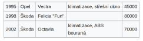

- CSV:
  - 1995,Opel,Vectra,"klimatizace, střešní okno",45000
    1998,Škoda,"Felicia ""Fun""",,80000
    2002,Škoda,Octavia,"klimatizace, ABS
    bouraná",70000

### Parametre pre upresnenie formatu

- `delimiter` - oddelovac stlpcov (default `','`)
- `quotechar` - vyclenenie pola sa specialnymi znakmi (default `'"'`)
- `doublequote` - zdvojenie quotecharu rusi jeho funkciu (default `True`)
- `escapechar` - rusi funkciu specialnych znakov (delimetru a quotecharu) (default `None`)
- `dialect` - nastavenie viacerych parametrov sucastne (napr. `excel`)

```python
with open('vzdialenosti.csv', 'w') as f:
    csvwriter = csv.writer(f, delimiter=';', quoting=csv.QUOTE_NONNUMERIC)
    csvwriter.writerows(vzdialenosti)
with open('vzdialenosti.csv') as f:
    print(f.read())
# "";"Brno";"Praha";"Ostrava"
# "Brno";0;202;165
# "Praha";202;0;362
# "Ostrava";165;362;0
```

## Format `JSON`

- JavaScript Object Notation
- [JSON](https://www.json.org/json-en.html)
- Mapovanie na typy Pythonu:
- 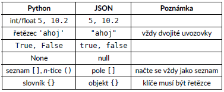

## Modul `json`

- `json.load()` - nacitaj JSON zo suboru
- `json.loads()` - nacitaj JSON z retazca
- `json.dump()` - zapis JSON so suboru
- `json.dumps()` - zapis Json do retazca

### Citanie

```python
with open('bob.json') as f:
    bob = f.read()
print(type(bob)) # <class 'str'>
print(bob)
# {
#   "name": "Bob",
#   "age": 30,
#   "married": false,
#   "cars": ["Ford", "BMW", "Fiat"]
# }
```

```python
import json

with open('bob.json') as f:
    bob = json.load(f)
print(type(bob)) # <class 'dict'>
print(bob) # {'name': 'Bob', 'age': 30, 'married': False, 'cars': ['Ford', 'BMW', 'Fiat']}

text = '{ "name": "John", "age": 35, "married": true, "cars": ["Mercedes", "BM
W", "Volkswagen"] }'
john = json.loads(text)
print(type(john)) # <class 'dict'>
print(john) # {'name': 'John', 'age': 35, 'married': True, 'cars': ['Mercedes', 'BMW', 'Volkswagen']}
```

### Zapis

```python
alice = {'name': 'Alice', 'age': 28, 'married': False, 'cars': ('Ford', 'Traban
t'), 10: 20 }

with open('alice.json', 'w') as f:
    json.dump(alice, f)

with open('alice.json') as f:
print(f.read())
# {"name": "Alice", "age": 28, "married": false, "cars": ["Ford", "Trabant"], "10": 20}

text = json.dumps(alice)
print(type(text)) # <class 'str'>
print(text)
# {"name": "Alice", "age": 28, "married": false, "cars": ["Ford", "Trabant"], "10": 20}

text = json.dumps(alice, indent=4)
print(text)
# {
#     "name": "Alice",
#     "age": 28,
#     "married": false,
#     "cars": [
#         "Ford",
#         "Trabant"
#     ],
#     "10": 20
# }
```

## Format `XML`

- Extensible Markup Language
- [linka](https://cs.wikipedia.org/wiki/Extensible_Markup_Language)

```xml
<messages>
  <note id="501">
    <to>Tove</to>
    <from>Jani</from>
    <heading>Reminder</heading>
    <body>Don't forget me this weekend!</body>
  </note>
  <note id="502">
    <to>Jani</to>
    <from>Tove</from>
    <heading>Re: Reminder</heading>
    <body>I will not</body>
  </note>
</messages>
```

## Zvysne moduly

1. Modul `lxml` - cita a zapisuje vo formate `XML`

- externy balicek, nutne doinstalovat pomocou pipu

2. Modul `pickle` - ulozenie pythonovskych dat v binarnom formate

- dokaze ulozit takmer lubovolny objekt (napr. funkciu)
- **Nebezpecie** - pickle subor z cudzieho zdroja moze obsahovat skodlivy kod

3. Modul `argparse` - predava argumenty z prikazoveho riadku

- rovnaky ucel ako `sys.argv`, ale sofistikovanejsi a krajsi pre uzivatela
- argumenty z prikazovaho riadku (netyka sa iba Pythonu):
  - Povinne
  - Volby/prepinace/options
    - zacinaju - (jednopismenne) alebo - - (viacpismenne)
    - mozu mat vlastne parametre

```python
import argparse

parser = argparse.ArgumentParser()
parser.add_argument('input', help='Input CSV file', type=str)
parser.add_argument('-H', '--header',
    help='Interpret the first line as column names', action='store_true')
parser.add_argument('-v', '--verbose',
    help='Print extra information', action='store_true')
parser.add_argument('-d', '--delimiter',
    help='Delimiter in the CSV file', type=str, default=',')
parser.add_argument('-s', '--stat',
    help='Statistics to be computed',
    choices=['mean', 'median', 'min', 'max'], default='mean')
args = parser.parse_args()
print('Input file:', args.input)
print('Header:', args.header)
print('Verbose:', args.verbose)
print('Delimiter:', args.delimiter)
print('Statistics:', args.stat)
```

- spustenie z prikazoveho riadku:

```
$ python3 make_statistics.py
$ python3 make_statistics.py --help
$ python3 make_statistics.py data.csv --stat median --header --verbose
$ python3 make_statistics.py data.csv -s median -Hv
```

1. Modul `requests` - internetova komunikacia cez protokol `HTTP`

- nutne doinstalovat pomocou pipu
- posielame poziadavky (request) na server pomocou metod `GET`, `POST`, `PUT`, `DELETE`, ...

```python
import requests

URL = 'http://endless.horse' # URL = Uniform Resource Locator = webová adresa
odpoved = requests.get(URL) # Používáme HTTP metodu GET
print('STATUS:', odpoved.status_code) # Status code: 200 = OK, 404 = Not Foun
d...
print('TEXT:', odpoved.text[-700:]) # Poslednych 700 znakov zo stiahnutého textu`python
STATUS: 200
TEXT: le="padding-top: 222px">
        <pre> ,
_,,)\.~,,._
(()`  ``)\))),,_
  |     \ ''((\)))),,_          ____
  |6`   |   ''((\())) "-.____.-"    `-.-,
  |   .'\     ''))))'                  \)))
  |   | `.       ''                     ((((
  \, _)   \/                            |))))
  `'       |                            (((((
           \                  |         ))))))
            `|    |           ,\       /((((((
             |   / `-.______.&lt;  \     | )))))
             |   |  /        `.  \  \    ((((
             |  / \ |          `. \  |   (((
             \  | | |           ) |  |    ))
              | | | |           | |  |    '</pre>
<a href="legs.html"></a>
</div>
  </body>
</html>
```

5. Modul `re` - regularny vyraz = regular expression = regex = RE

- sposob ako zapisat obecne vzorku textu, ktory chceme vyhladat/nahradit/...

```python
import re

text = 'Helloooo! She sells sea shells. Good as hell!'
vzorka1 = re.compile('[Hh]ello*')
vzorka1.findall(text) # ['Helloooo', 'hell', 'hell']

vzorka2 = re.compile(r'\b[Hh]ello+\b')
vzorka2.findall(text) # ['Helloooo']

vzorka2.sub('Ciao', text) # 'Ciao! She sells sea shells. Good as hell!'
```

**Vysvetlenie**

- `[Hh]` jeden znak z vyctu ('H' alebo 'h')
- `o*` lubovolny pocet (vratane O) opakovanie o ('' aleb 'o' alebo 'oo'...)
- `o+` aspon 1 opakovanie o ('o' alebo 'oo' ...)
- `\b` hranica slova
- `dlsie moznosti pouzitia`:
  - [re.html](https://docs.python.org/3.7/library/re.html)
  - [regex.html](https://docs.python.org/3.7/howto/regex.html)
- **POZOR!!!** - pravidla `re` a `glob` su ine

# 9. VEDECKY PYTHON

- instalacia

```
python -m pip install numpy/jupyter/atplotlib
```

## NumPy

- je to standard pre numericke vypocty v Pythone
- velke mnozstvo dalsich modulov postavenych nad NumPy

```python
import numpy as np
```

- zakl. objekt s ktorym NumpPy pracuje
- iba prvky rovnakeho typu
- fixna velkost

```python
np.array([1, 3, 4])
# array([1, 3, 4])
```

```python
np.arange(10) #array([0, 1, 2, 3, 4, 5, 6, 7, 8, 9])
```

- funkcia `linspace`

```python
np.linspace(0, 1, 11)
# array([0. , 0.1, 0.2, 0.3, 0.4, 0.5, 0.6, 0.7, 0.8, 0.9, 1. ])

np.random.sample(10)
# array([0.62666803, 0.07045182, 0.20550107, 0.36733577, 0.38851806,
#        0.03756064, 0.90113418, 0.6652082 , 0.43018563, 0.6772363 ])
```

# Zakladne operacie

```python
a = np.arange(10)
a # array([0, 1, 2, 3, 4, 5, 6, 7, 8, 9])
```

- Operacie sa prevadza nad celym polom, nie je nutne pouzivat `for` cyklus

```python
a + 1 # array([ 1, 2, 3, 4, 5, 6, 7, 8, 9, 10])

a ** 2 # array([ 0, 1, 4, 9, 16, 25, 36, 49, 64, 81])
```

# Viacejrozmerne pole

```python
a = np.arange(25)
a # array([ 0, 1, 2, 3, 4, 5, 6, 7, 8, 9, 10, 11, 12, 13, 14, 15, 16, 17, 18, 19, 20, 21, 22, 23, 24])
a.shape # (25,)
b = a.reshape(5, 5)
b # array([[ 0, 1, 2, 3, 4],
        # [ 5, 6, 7, 8, 9],
        # [10, 11, 12, 13, 14],
        # [15, 16, 17, 18, 19],
        # [20, 21, 22, 23, 24]])

b.shape #(5, 5)

b[2, :] # array([10, 11, 12, 13, 14])
b[:, 4] # array([10, 11, 12, 13, 14])
b[3:6, 2] # array([17, 22])
```

- vytvorenie pole 3 x 3 pomocou funkcie `zeros()`

```python
np.zeros((3, 3)) # array([[0., 0., 0.],
                        # [0., 0., 0.],
                        # [0., 0., 0.]])
```

- to same s jednixckami `ones()`

```python
x = np.ones((3, 3))
x # array([[1., 1., 1.],
         # [1., 1., 1.],
         # [1., 1., 1.]])
```

- vytvorim si jednotkovu maticu pomocou funkcie `eye()`

```python
np.eye(3)
# array([[1., 0., 0.],
       # [0., 1., 0.],
       # [0., 0., 1.]])
```

```python
3 * np.eye(3) + np.arange(9).reshape(3, 3)
# array([[ 3., 1., 2.],
       # [ 3., 7., 5.],
       # [ 6., 7., 11.]])
```

# Uzitocne funkcie

```python
b = np.arange(25), reshape(5, 5)
b # array([[ 0, 1, 2, 3, 4],
        # [ 5, 6, 7, 8, 9],
        # [10, 11, 12, 13, 14],
        # [15, 16, 17, 18, 19],
        # [20, 21, 22, 23, 24]])
```

```python
a = np.arange(30).reshape(5, 6)
np.min(a), np.max(a), np.sum(a), np.mean(a) # (0, 29, 435, 14.5)
```

- vsetky spomenute funkcie maju parameter `axis`, ktory urcuje, ci previest funkciu cez riadkz alebo stlpce

```python
a = np.arange(30).reshape(5, 6)
np.sum(a, axis=0) # array([60, 65, 70, 75, 80, 85])

np.sum(a, axis=1) # array([ 15, 51, 87, 123, 159])
```

# Linearna algebra

- `np.linalg`
- velke mnozstvo funkcii (determinaty, inverzne matice, vlastne hodnoty, ...)

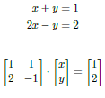

```python
A = np.array([[1, 1], [2, -1]])
A # array([[ 1, 1],
        # [ 2, -1]])

b = np.array([1, 2])
b # array([1, 2])

np.linalg.solve(A, b) # array([1., 0.])
```

# Vizualizacia dat - `matplotlib`

- asi najrozsirenejsi modul
- podobny syntax ako v Matlabu
- velke mnozstvo nastaveni, typy grafov
- pracujeme nad NumPy polom

```python
import matplotlib.pyplot as plt
```

- funkcia `plot` - vykreslovacia funkcia
- defaltne vykresluje spojenu ciaru
- `-o` vykreslenie v bodoch, `'x'` - vykreslenie v znaku x
- funkcia `grid` - zobrazi sa mi mriezka

```python
xs = np.linspace(0, 10, 50)
plt.plot(xs, np.sin(xs))
plt.show() # [<matplotlib.lines.Line2D at 0x7fef25f51250>]
```

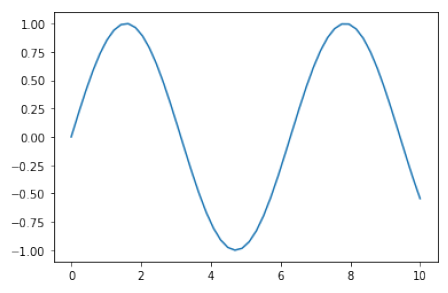

```python
xs = np.linspace(0, 10, 50)
plt.grid()
plt.plot(xs, np.sin(xs), '-o', color='red')
# [<matplotlib.lines.Line2D at 0x7fef25eb2950>]
```

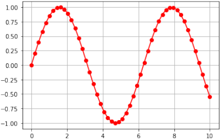

- ak vykreslujem viac os tak musim pouzit funkciu `legend()`

```python
plt.grid()
plt.xlim(-1, 11)
plt.ylim(-2, 2)
plt.title('Goniometrické funkce')
plt.plot(xs, np.sin(xs), label='$y = \sin{x}$')
plt.plot(xs, np.cos(xs), label='$y = \cos{x}$')
plt.legend() # <matplotlib.legend.Legend at 0x7fef25e975d0>
```

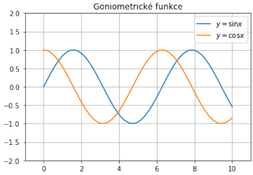

- stlpcovy graf `bar`

```python
x = np.random.randint(10, size=10)
x # array([1, 4, 4, 8, 6, 3, 4, 7, 1, 3])

plt.bar(np.arange(10), x)
# <BarContainer object of 10 artists>
```

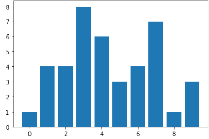

- histogram = ukazuje cetnost
- funkcia `hist()` -
- `bins`

```python
plt.hist(np.random.sample(100), bins=15)
# (array([ 4., 9., 5., 4., 5., 5., 10., 5., 5., 7., 8., 12., 5.,
# 11., 5.]),
# array([0.02412496, 0.08896623, 0.1538075 , 0.21864877, 0.28349004,
# 0.34833131, 0.41317258, 0.47801385, 0.54285512, 0.60769639,
# 0.67253765, 0.73737892, 0.80222019, 0.86706146, 0.93190273,
# 0.996744 ]),
# <a list of 15 Patch objects>)
```

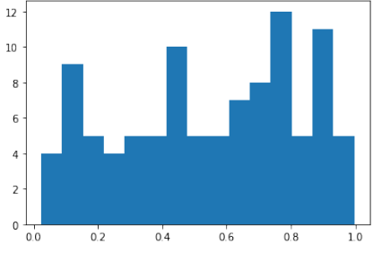

- Bodovy graf `scatter`

```python
xs = np.random.sample(50)
ys = np.random.sample(50)
sizes = np.random.randint(100, size=50) # oplivnuje velkost bodov
colors = np.random.randint(3, size=50) # budem mat 3 farby

plt.scatter(xs, ys, c=colors, s=sizes) # volam
# <matplotlib.collections.PathCollection at 0x7fef25eba6d0>
```

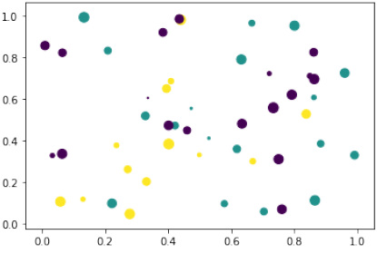

# NumPy - masky

- funkcia `mask` - zamaskujem urcite data, kt nevyhovuje mojejj odmienky

```python
a = np.random.randint(100, size=16).reshape(4, 4)
a # array([[54, 23, 7, 62],
        # [28, 53, 69, 81],
        # [72, 76, 11, 63],
        # [67, 40, 41, 61]])
a > 20 # tie kt. splnaju podmienky
a # array([[ True, True, False, True],
        # [ True, True, True, True],
        # [ True, True, False, True],
        # [ True, True, True, True]])
mask = a > 20
a[mask] # array([54, 23, 62, 28, 53, 69, 81, 72, 76, 63, 67, 40, 41, 61])
a[~mask] # array([ 7, 11])
```

- vyuzitie `mask`, napr. chcem vykreslit niektore data inou farbou.

```python
xs = np.arange(100)
ys = np.random.sample(100)
plt.scatter(xs, ys)
```

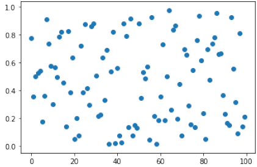

```python
xs = np.arange(100)
ys = np.random.sample(100)
for threshold in np.linspace(0, 1, 6):
mask = (ys > threshold) & (ys < threshold + 0.2)
plt.scatter(xs[mask], ys[mask])
```

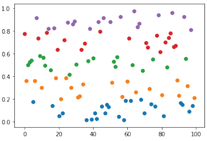

# Nahodny vypocet piii

```python
xs = np.random.sample(10000) * 2 - 1 # body suradnic ktore su v rozsahu od -1 do 1, vdaka nasobeniu 2 a odpocitaniu 1
ys = np.random.sample(10000) * 2 - 1

mask = xs ** 2 + ys ** 2 <= 1 # vykresli mi plnykruh
plt.scatter(xs[mask], ys[mask])
plt.scatter(xs[~mask], ys[~mask])

4 * np.sum(mask) / len(mask) # pocet bodov v ktuhu/pocet bodov v celej maske a vyde mi moje pii
# 3.138 - ak zvacsim pocet bodov tak ziskam presnejsie pii
```

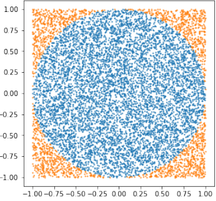

# NumPy Vstup a Vystup

- textovy
  - `np.savetxt` a `np.loadtxt`
  - precuje so standartnym `CSV`
  - potreba nastavit sposob ulozenia a nacitania
- binarny

  - `np.save` a `np.load`
  - rychlejsi, mensia velkost

- `%%timeit` - zmeriam cas ako dlho bude trvat vygenerovanie

```python
%%timeit
[x ** 2 for x in range(1000)]
# 185 μs ± 967 ns per loop (mean ± std. dev. of 7 runs, 10000 loops each)

%%timeit
np.arange(1000) ** 2
# 2.46 μs ± 23.4 ns per loop (mean ± std. dev. of 7 runs, 100000 loops each)
```

# Sucet dvoch zoznamov/poli

```python
a = list(np.random.sample(1000))
b = list(np.random.sample(1000))
```

- Python = tri sposoby:

```python
%%timeit
c = []
for 1 in range(len(a)):
    c.append(a[1] + b[1])
```

```python
%%timeit
c = []
for x, y in zip(a, b):
    c.append(x + y)
```

```python
%%timeit
c = [x + y for x, y in zip(a, b)]
```

- NumPy:

```np
%%timeit
c = a + b
```
